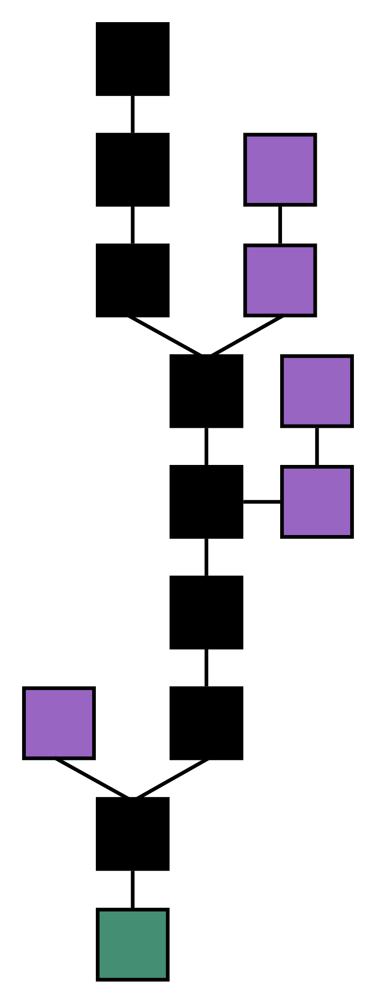

# Module 1 - Introduction to Blockchains & Cryptocurrency

This module introduces the concept of blockchains, their limitations, and payment channels on the Internet Computer.

## Outline

1. [What is a Blockchain?](#What-is-a-Blockchain?)

2. [What is a Cryptocurrency?](#What-is-a-Cryptocurrency?)
3. [Cryptocurrency Limitations](#Cryptocurrency-Limitations)
4. [Payment Channels](#Payment-Channels)

## What is a Blockchain?

A **blockchain** is a list of records, often referred to as a ledger, that utilizes elements of cryptography to store transactions in an open, tamperproof way. Each "block" rep represents a new grouping of transactions and contains three key components:

1. **Data:** The information stored in each block depends on the type of blockchain. For instance, many cryptocurrencies such as Bitcoin store transaction details like the sender, receiver, and amount. 
2. **Hash:** A block's *hash* is a unique string of characters used to identify and distinguish it from other blocks.
3. **Hash of Previous Block:** Blocks also store the hash of the previous block, creating the so-called "blockchain." Think of the blockchain as akin to a linked-list data structure (albeit with some significant differences, which we will discuss). 

 

 <i>Source: <a href="https://medium.com/swlh/blockchain-characteristics-and-its-suitability-as-a-technical-solution-bd65fc2c1ad1">Venkat Kasthala, Medium</a></i>

Blockchains are unique in their ability to prevent tampering and provide open verification of blocks added to the chain. If a block is modified, its hash changes and all subsequent blocks no longer point to the correct hash, invalidating them. A nefarious actor would need to go through all of the following blocks and re-calculate their hashes to modify the blockchain.

However, blockchains use something called **proof-of-work** to prevent this from happening. Proof-of-work uses a form of distributed consensus to verify blocks before they are added to the chain. This slows down the block-verification process (typically requiring anywhere from seconds to minutes per block added to the chain), making it infeasible for a malicious actor to change a block and re-verify the subsequent blocks in the chain.

Finally, blockchains use a **distributed system** to manage blockchain verification. Using a **peer-to-peer** (P2P) network, every entity receives a copy of the current blockchain state. When a new block is added to the chain, all nodes on the network receive that block and verify that it hasn't been tampered with, adding it to their own blockchain. This process, called **consensus**, means that a majority of nodes on the network must agree on the validity of blocks before they are added.

## What is a Cryptocurrency?

**Cryptocurrencies** utilize blockchains to record transactions between entities. As users send and receive amounts of the given cryptocurrency, these transactions are broadcast across the P2P network. Other entities listen for these transactions, group them together into a single "block" every so often, and then broadcast this new block to the network once a proof-of-work is calculated. 

In the case of Bitcoin, we "trust" whichever ledger has the most about of verifiable work put into it, which comes from the proof-of-work step. Additionally, Bitcoin rewards the block creator, called a **miner**, with a small amount of Bitcoin to incentivize this computationally-intensive process. For example, if there are two conflicting blockchains, nodes choose the longest one because it required the most work to verify; ties are resolved by waiting until one of the conflicting chains becomes longer than the other. Blocks not included in the main chain are called **orphan blocks**. If every node follows these predetermined rules, called a **protocol**, we have a clear way of arriving at decentralized consensus of the blockchain.

 <i>Blockchain formation from genesis block (green). The longest series of blocks constitutes the main chain (black), and orphan blocks (purple) branch off the main chain. Source: <a href="https://en.wikipedia.org/wiki/Blockchain">Blockchain Wiki</a></i>

### Cryptocurrency Limitations

Despite the immense benefits of using blockchain to process payments, transaction processing can both slow to a crawl and grow increasingly expensive during times of high network activity. The Bitcoin network, for instance, is limited by its ~10 minute block creation time and max block size of 1 MB, vastly restricting the network's throughput. As a result, Bitcoin only processes about 5 transactions per second; compare this with Visa's network, which can process [tens of thousands of transactions per second](https://usa.visa.com/dam/VCOM/download/corporate/media/visanet-technology/aboutvisafactsheet.pdf). 

Several solutions have been proposed to solve this issue. In blockchain terminology, **Layer 1** refers to the base censuses layer of the cryptocurrency. The first proposed solution relies on a change to Layer 1 to increase the maximum block size; such a change is called a **hard fork** because it constitutes a significant change to the network's protocol that all nodes must upgrade to. In 2017, a [hard fork of Bitcoin](https://www.investopedia.com/tech/history-bitcoin-hard-forks/) (BTC) resulted in Bitcoin Cash (BCH), which increased the maximum block size from 1 MB to 8 MB. This, however, created two separate Bitcoin cryptocurrencies (BTC and BCH) that traded at separate values. 

### Payment Channels

Instead of creating a hard fork that modifies Layer 1, a second solution to cryptocurrency's throughput issue involves creating a **Layer 2** protocol that operates on top of the underlying Layer 1 blockchain. **Payment Channels** are one such Layer 2 protocol that aim to enable faster and more affordable microtransactions, increasing the throughput of the network. Payment Channels allow users to make payments without immediately committing each transaction to the blockchain. 

Bitcoin, for instance, uses a payment channel called the **Lightning Network**, which operates by opening an "off-chain" payment channel between two users. These two users can make any number of transactions without the payments ever reaching the main blockchain. Once the users decide to reconcile their activity, they conduct a final closing transaction on the blockchain that represents the net outcome of the series of off-chain payments.  
