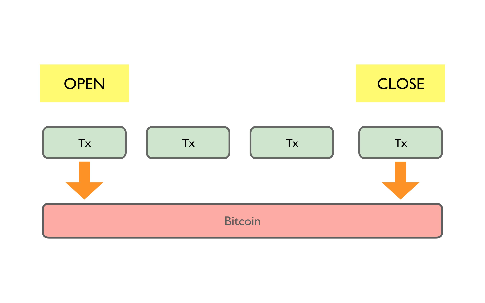
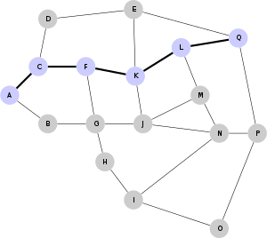

# Module 3: Implementing Payment Channels

In this module, you will use the **ERC-20** style token introduced in [Module 2](#module-2.md) to implement their own payment channel system in Motoko. By the end of this module, users will be able to both create a new payment channel and add funds from their token wallet to this channel. 

## Understanding

Now that you have an understanding of tokens and how they can be implemented in Motoko, we'll move on to the second phase of this project: implementing payment channels. We discussed payment channels briefly in [Module 1](#module-1.md#payment-channels), but we'll provide a quick recap here as well. 

Transacting often with blockchain-based cryptocurrencies presents two main issues. First, most blockchains have limited throughput, limiting the speed with which transactions can be conducted. Second, each transaction requires a small fee to support "miners" in the system, which can quickly grow to a large sum over frequent transactions. 

To avoid these throughput and fee issues, we introduce the notion of **payment channels**. Payment channels are "off-chain" transactions, meaning that each currency exchange isn't published to the blockchain, that exist between two users.

### Example: Alice and Bob

Let's imagine that Alice and Bob are two users that plan on transacting often enough with each other that they run into the throughput and fee issues we outlined above. Alice and Bob decide to open up a payment channel, which initially requires that they each put a set amount of funds aside for use in the payment channel. These funds are held in escrow until both parties decide to close the channel. When the channel is initially opened, this transaction is logged on the chain.

Next, Alice and Bob conduct a series of transactions back and forth without publishing them to the chain. Note, however, that these transactions simply modify an IOU ledger showing who owes whom money. At no point in these transactions do either party exchange actual cryptocurrency on the chain. Finally, when Alice and Bob want to "settle-up," they tally their transactions and determine who should pay whom. This final transaction "closes" the payment channel and is logged on the chain.

 <i> Only two transactions, the first and the last, are published to the chain. Source: <a href="https://medium.com/@happypeter1983/payment-channels-9181941b83e4">happypeter on Medium</a></i>

However, having to open up a new payment channel for each person you want to transact with is quite inefficient. Fortunately,  some payment channel implementations, such as Bitcoin's [Lightning Network](https://en.wikipedia.org/wiki/Lightning_Network), incorporate a mesh network of payment channels that connect users to everyone else in the network. Now, to transact with a new person, you can send funds through someone you already have an existing channel open with as long as there is a "path" of channels leading to the recipient. We can visualize this relationship as a graph, where users are the nodes and open payment channels are edges.

 <i> User 'A' can transact with 'Q' via the highlighted payment channel path. Source: <a href="https://en.wikipedia.org/wiki/Lightning_Network#/media/File:17_node_mesh_network.svg">Wikipedia Lightning Network</a></i>

## Your Task

In this exercise, you will implement methods that enable users to open new payment channels and contribute funds to them. We will finish the other parts of this payment channel implementation, namely the ability to close channels, in [Module 4](#module-4.md).

After creating the first portion of this payment channel, you will experiment with it through the command line by creating a new channel with a dummy user and adding funds.

### Code Understanding

#### `Types.mo`

There are three main types that we use in this payment channel implementation. First, a `PaymentChannel` type stores attributes about a specific payment channel. Namely, we include:

* The two users, `userA` and `userB`
* The amounts they have contributed, respectively, to the payment channels, `amountA` and `amountB`
* A flag indicating if the channel is in the process of closing, `closing`
* The user who initiated the closing process, `closingUser`
* The time the other user has to either accept or reject the closing proposal, `ttl` (aka "Time to live")

The `Tx` type stores information about the final transaction that is registered on the blockchain. Finally, `Error` maintains a list of the possible error messages in the program.

#### `vendor/motoko-token`

This is where the ERC-20 style token that we discussed in Module 2 is implemented. Make sure you have a clear understanding of how this Token operates, discussed in Module 2, before proceeding with this activity. You will call several of the Token's methods in this activity.

**Big Idea:** One method that is especially important for this module is `approve`, which allows the given `spender` to spend `amount` tokens on behalf of the function caller. In order for two users to open a payment channel with each other, they first must `approve` the payment channel canister to "spend" tokens on their behalf. Checking that users have done this before opening up a new channel is something that you must verify in the `setup()` method.  

#### `Main.mo`

`paymentChannels` is a hash map that stores all of the open payment channels. We identify a payment channel between two users via a `hash` derived from their user IDs (implemented by `genKey()`). Note that any pair of two unique users can only have one open payment channel with each other, but they may have as many open channels as desired with other distinct users.

`genKey()` accepts two users and creates a `hash` from their user IDs. Make sure you understand how we ensure that invoking this method always returns the same hash for two users regardless of which is the `party` and the `counterparty` (i.e. `genKey(Alice, Bob) == genKey(Bob, Alice)`).

#### `User.mo`

This is a "dummy" canister that you can use to open a payment channel with. You can access its canister ID by invoking the `whoAmI()` method.

### Specification

**Task:** Complete the implementation of the `setup()` and `addFunds()` methods in `Main.mo`

**`setup()`** accepts a `counterpart` and `amount` and creates a new payment channel between the caller of this method and the `counterpart`, contributing `amount` to the calling user's balance in the payment channel.

* First ensure that the caller of this method has `amount` available in their token wallet, which is stored in the `Token` canister. This step will require an `await` call to `Token` to access the user's balance. If the user doesn't have `amount` available, return the `#insufficientBalance` error.
* Next, we want to take `amount` of funds from the caller and lock it in escrow. You can make use of the `transferFrom` method in `Token.mo` to transfer funds from the user to the payment channel canister. Note that this is only possible if the user first approved the payment channel canister as an authorized "spender", which you check in the first step.
* Retrieve the `hash` representing the payment channel between these two users by invoking `genKey()`
* Finally, check if the payment channel represented by the `hash` you just found already exists in `paymentChannels`. If so, return the `#paymentChannelAlreadyExists` error. Otherwise, create a new `PaymentChannel` using the information you've collected and put it in the `paymentChannels` hashmap

**`addFunds`** adds `amount` to the method caller's balance in the `PaymentChannel` associated between the caller and `counterparty`.

* As you did at the beginning of `setup()`, (1) ensure that the caller of this method has `amount` available in their token wallet and (2) remove `amount` of funds from the user calling this method
* When you check for the payment channel in `paymentChannels`, ensure that it is not currently in the process of `closing`. If so, return the `#paymentChannelClosing` error. 
* Check if the caller is `userA` or `userB` in the `PaymentChannel` and add `amount` to the corresponding field (`amountA`/`amountB`)
* If the payment channel doesn't exist, return the `#paymentChannelDoesNotExist` error
